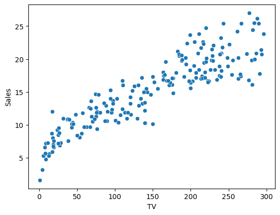

```python
#import libraries
import numpy as np
import pandas as pd
import seaborn as sns
```


```python
#read data
df = pd.read_csv("data/advertising.csv")
```


```python
#look at the data
df.head()
```


<div>
<style scoped>
    .dataframe tbody tr th:only-of-type {
        vertical-align: middle;
    }

    .dataframe tbody tr th {
        vertical-align: top;
    }

    .dataframe thead th {
        text-align: right;
    }
</style>
<table border="1" class="dataframe">
  <thead>
    <tr style="text-align: right;">
      <th></th>
      <th>TV</th>
      <th>Radio</th>
      <th>Newspaper</th>
      <th>Sales</th>
    </tr>
  </thead>
  <tbody>
    <tr>
      <th>0</th>
      <td>230.1</td>
      <td>37.8</td>
      <td>69.2</td>
      <td>22.1</td>
    </tr>
    <tr>
      <th>1</th>
      <td>44.5</td>
      <td>39.3</td>
      <td>45.1</td>
      <td>10.4</td>
    </tr>
    <tr>
      <th>2</th>
      <td>17.2</td>
      <td>45.9</td>
      <td>69.3</td>
      <td>12.0</td>
    </tr>
    <tr>
      <th>3</th>
      <td>151.5</td>
      <td>41.3</td>
      <td>58.5</td>
      <td>16.5</td>
    </tr>
    <tr>
      <th>4</th>
      <td>180.8</td>
      <td>10.8</td>
      <td>58.4</td>
      <td>17.9</td>
    </tr>
  </tbody>
</table>
</div>


```python
sns.scatterplot(data=df,x="TV",y= "Sales");
```


    

    


```python
def simple_lin_reg(x : pd.Series,y :pd.Series):
    mean_x : int = x.mean()
    mean_y : int = y.mean()
    
    sum_num = 0
    sum_denum = 0
    for i in range(len(x)):
        sum_num += (x.iloc[i] - mean_x) * (y.iloc[i] - mean_y)
        sum_denum += (x.iloc[i] - mean_x) ** 2

    b1 : float = sum_num / sum_denum if sum_denum != 0 else 0
    print("b0 =>", mean_y - b1 * mean_x )
    print("b1 =>" , b1 )

```


```python
#testing
simple_lin_reg(df["TV"], df["Sales"])
```

    b1 => 0.05546477046955879
    b0 => 6.974821488229903
    
